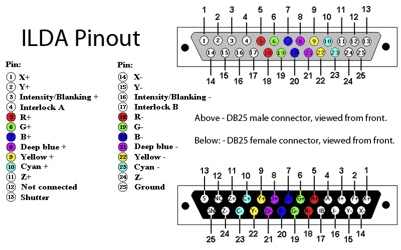

# DAC_ILDA Adaptor
##### v 0.1
## Abstract
This tutorial walks you through building a simple DAC_ILDA adaptor for converting audio signals sent from a multi-channel [DAC](http://www.expert-sleepers.co.uk/siwacompatibility.html) (Digital Analog Converter) to an [ILDA Interface](https://www.laserworld.com/en/show-laser-light-faq/glossary-definitions/79-i/1316-ilda-eng.html "ILDA") (International Laser Display Association standard used for laser light systems) to control the XY-axis, RGB and intensity of the beam.

*Warning: This is an amateur guide for interfacing an audio DAC with IDLA. Use at your own (+ laser) risk – each laser spec may have an custom requirements for voltage/frequency limiting needs. Be careful.*

## Wiring Diagram

## Requirements
### Adaptor
- ILDA female connector (DB25)
- 6x 1/4" balanced (TRS) female jacks
- 6x 1/4" balanced (TRS) cables
- 1x toggle switch (on/off)
- Various colored wires (jumper cables)
- Project box
- Soldering iron + wire
- Wirecutters

### Setup
- RGB Laser with ILDA interface
- ILDA cable
- DAC (multi-channel, balanced, ideally DC-Coupled outputs)
- Computer for producing audio signals

## Instructions
### 1 – Prep
Grab 2x jumper cables per 6x different colors (12x total). Cut them all in half and wirestrip the cut ends. Separate into two piles of female/male, using one for the connector and one for the jacks.

Drill/cut holes in project box for 6x 1/4" jacks on the top, ILDA connector and toggle switch on the sides.

### 2 – ILDA Interface
Feature  | Pins | Comment
:-------- | :------- | :---------
X-Axis + / -   | 1 / 14 | Horizontal movement, 10V
Y-Axis + / -   | 2 / 15 | Vertical movement, 10V
Blanking + / -   | 3 / 16 | Beam intensity, 5V
Interlock A / B   | 4 / 17 | Enables output when joined
Red + / -   | 5 / 18 | Red mixture, 5V
Green + / -   | 6 / 19 | Green mixture, 5V
Blue + / -   | 7 / 20 | Blue mixture, 5V
Ground   | 25 | Connected to all jacks sleeve
 | | 
Z-Axis | 11 / 24 | For DMX? See Blanking.

[ILDA Pinout Source](https://vuo.org/comment/3145#comment-3145)

Soldering paired color jumper cables to pins:

##### Notes
Diagram shows female ILDA connector from *front*, so flip pins horizontally when soldering to the back! I've already made that mistake for you...

Use different colored jumper cables per feature (8 total) to the diagram for easily identifying and patching the jacks to pins.

I wired jumpers to the Z-Axis pins (11/24), but not yet sure if they're needed.

*Interlock A / B* is a safety mechanism that only allows the laser to work if they're connected. I recommend using a basic toggle switch between these two pins.

#### 3 – Jacks
Solder the opposite end of your jumper cables to the balanced 1/4" jacks, one on the tip and one on the ring. Leave the sleeve (ground) empty for now.

Mount jacks into the box 2 at a time, soldering a common ground wire between all of the sleeves. Eventually connect a jumper cable to this for linking to the ILDA connectors ground pin.

#### 4 – Switch
Solder 2x jumper cables to the toggle switch, so in the on position they're joined.

#### 5 – Patch
Feed the ILDA connector and jumper cables into it's cutout slot until snug. Connect the jumper cables, using + (top) of ILDA connector cables to the Tip soldered cable of the jacks. 

Attach the two switch jumpers to Interlock (4 / 17).

Common sleeve jumper to Ground (25)

Hook up your DAC » jacks + ILDA » laser and away you go!

## Software
There are plenty of tools for generating a stereo X-Y audio signal from vector graphics, however not all are ready (yet) for all 6 channels of audio (XY + RGB + blanking). Here's a few to check out:

Tool  | Environment | Comment
:-------- | :------- | :------
[XYscope](http://teddavis.org/xyscope/) | Processing | Laser functions pending
[Vector Synthesis](http://macumbista.net/?page_id=4869)  | PureData | Laser patch planned
[ReWereHere](http://i.m.klif.tv/rewerehere/) | Max/MSP | 
[OsciStudio](https://oscilloscopemusic.com/oscistudio.php) | Application |

## Notes
### References
- [ILDA Connector details from LaserWorld](https://www.laserworld.com/en/laser-projectors-technical-faq/1140-how-is-the-ilda-connector-pinout.html)
- [ILDA pins details from laserfx.com](http://www.laserfx.com/Backstage.LaserFX.com/Standards/ISP-DB25.html)
- [Switchcraft TRS Jack Diagram](http://www.switchcraft.com/Documents/12b_cd.pdf)

### Acknowledgements
In conversation with Joseph Hyde + Derek Holzer.

### Contribute
Something missing? Create an issue on [Github source]().

### Author
cc [teddavis.org](http://teddavis.org) 2018